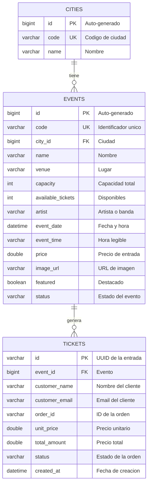

# Ticketera - Microservicio de Venta de Entradas (Hito Final)


Ticketera es un sistema de venta de entradas para eventos independientes. Este repositorio evoluciona el **Core de Dominio Puro** construido en el Hito 3 hacia un **microservicio con Spring Boot, PostgreSQL y Docker**, manteniendo el núcleo (`domain` y `application`) completamente aislado de frameworks, siguiendo los principios de **Clean Architecture**, **Domain-Driven Design (DDD)** y **Hexagonal Architecture (Ports & Adapters)**.

**Estado del Hito 4:** migración a Spring Boot, adaptador de persistencia JPA/PostgreSQL, capa web REST con manejo global de errores, configuración por perfiles (dev/prod) con Swagger aislado, Docker Compose con PostgreSQL, Dockerfile multi-stage seguro y colección de pruebas de contrato con Bruno.

**Seguridad:** HTTP Basic auth para mutaciones admin, CORS centralizado via `CorsConfigurationSource`, passwords con BCrypt, sesiones stateless, Dockerfile con usuario no-root.

## Links del proyecto

- **Repositorio Frontend**: [Link](https://github.com/pablocelva/ticketera-hito-final-frontend)
- **Despliegue en Netlify:** [Link](https://ticketera-hito-2.netlify.app/)

Repositorios que sirven de base a este proyecto:

- **Hito 1** (núcleo inicial de la ticketera): [hito1-ticketera](https://github.com/pablocelva/hito1-ticketera)
- **Hito 2** (frontend inicial con typescript): [hito2-ticketera-frontend](https://github.com/pablocelva/hito2-ticketera-frontend)
- **Hito 3** (refactor DDD / Clean-Hexagonal): [hito3-backend-domain-driven-design](https://github.com/pablocelva/hito3-backend-domain-driven-design)
- **Hito 4** (refactor con Spring Boot y Swagger): [hito4-backend-spring-boot](https://github.com/pablocelva/hito4-backend-spring-boot)

## Índice

- [Tecnologías y dependencias](#tecnologías-y-dependencias)
  - [Lenguaje y plataforma](#lenguaje-y-plataforma)
  - [Build](#build)
  - [Dependencias principales](#dependencias-principales)
  - [Dependencias de testing (scope: test)](#dependencias-de-testing-scope-test)
  - [Plugins de Maven](#plugins-de-maven)
- [Arquitectura](#arquitectura)
  - [Estructura del directorio](#estructura-del-directorio)
  - [Descripción de archivos](#descripción-de-archivos)
  - [Nota sobre la arquitectura](#nota-sobre-la-arquitectura)
- [Modelo de datos](#modelo-de-datos)
- [Lenguaje Ubicuo](#lenguaje-ubicuo)
- [Contexto Delimitado](#contexto-delimitado)
- [API REST](#api-rest)
  - [Contratos de los endpoints](#contratos-de-los-endpoints)
  - [Manejo global de errores](#manejo-global-de-errores)
- [Documentación interactiva (Swagger UI)](#documentación-interactiva-swagger-ui)
- [Infraestructura Docker](#infraestructura-docker)
- [Perfiles de ejecución](#perfiles-de-ejecución)
- [Pruebas de contrato (Bruno)](#pruebas-de-contrato-bruno)
- [Testing y Garantía de Calidad](#testing-y-garantía-de-calidad)
  - [Resumen de cobertura por clase](#resumen-de-cobertura-por-clase)
- [Instrucciones de ejecución](#instrucciones-de-ejecución)
  - [Levantar la base de datos con Docker](#levantar-la-base-de-datos-con-docker)
  - [Arrancar el microservicio en perfil dev](#arrancar-el-microservicio-en-perfil-dev)
  - [Arrancar el microservicio en perfil prod](#arrancar-el-microservicio-en-perfil-prod)
  - [Verificar la persistencia en PostgreSQL](#verificar-la-persistencia-en-postgresql)
  - [Compilar y verificar el proyecto](#compilar-y-verificar-el-proyecto)
  - [Ejecutar la suite de pruebas unitarias](#ejecutar-la-suite-de-pruebas-unitarias)
  - [Generar el reporte de cobertura JaCoCo](#generar-el-reporte-de-cobertura-jacoco)
- [Referencia rápida de comandos](#referencia-rápida-de-comandos)

## Tecnologías y dependencias

### Lenguaje y plataforma
- **Java 17** sobre **Spring Boot 3.5.7** (`spring-boot-starter-parent`)
- **Hibernate** como proveedor JPA (incluido en `spring-boot-starter-data-jpa`)

### Build
- **Apache Maven** — Sistema de construcción y gestión de dependencias
- **spring-boot-maven-plugin** — Empaqueta el jar ejecutable y permite arrancar con `mvn spring-boot:run`

### Infraestructura
- **Docker / Docker Compose** — Provisiona la base de datos del microservicio (`compose.yaml`)
- **PostgreSQL 16** — Base de datos relacional persistente (contenedor `pg-ticketera`, puerto `5433`)

### Dependencias principales

| Dependencia | Versión | Propósito |
|---|---|---|
| `spring-boot-starter-web` | gestionada por Spring Boot | API REST con Spring Web MVC y Tomcat embebido |
| `spring-boot-starter-validation` | gestionada por Spring Boot | Validación declarativa con Jakarta Bean Validation (`@Valid`, `@NotBlank`, etc.) |
| `spring-boot-starter-data-jpa` | gestionada por Spring Boot | Persistencia con Spring Data JPA e Hibernate |
| `postgresql` | gestionada por Spring Boot | Driver JDBC de PostgreSQL (scope `runtime`) |
| `spring-boot-starter-security` | gestionada por Spring Boot | Autenticación HTTP Basic para mutaciones admin |
| `springdoc-openapi-starter-webmvc-ui` | 2.8.9 | Especificación OpenAPI 3 y Swagger UI interactiva |

### Dependencias de testing (scope: test)

| Dependencia | Versión | Propósito |
|---|---|---|
| `spring-boot-starter-test` | gestionada por Spring Boot | Incluye JUnit 5 (API, engine y params), Mockito, AssertJ y MockMvc |
| `h2` | gestionada por Spring Boot | Base de datos en memoria para tests de integración de Security (scope `test`) |

### Plugins de Maven

| Plugin | Versión | Propósito |
|---|---|---|
| `spring-boot-maven-plugin` | 3.5.7 | Genera el jar ejecutable y habilita `mvn spring-boot:run` |
| `maven-surefire-plugin` | gestionada por Spring Boot | Ejecuta la suite de tests con soporte para nombres legibles de JUnit 5 |
| `jacoco-maven-plugin` | 0.8.15 | Instrumenta el código y genera reportes de cobertura (instrucciones, ramas, métodos, líneas). Excluye `com/ticketera/infrastructure/**` y la clase bootstrap `TicketeraApplication` |
| `jacoco-console-reporter` | 1.3.2 | Imprime un resumen de cobertura directamente en la consola |

> **Nota sobre cobertura:** la capa `infrastructure` (detalles técnicos: adaptador de persistencia JPA y notificador por email), los contratos de `domain/repository` (interfaces puras sin lógica) y la clase bootstrap `TicketeraApplication` quedan **excluidos** del reporte de cobertura. Esto se configura con la propiedad `sonar.coverage.exclusions` (usada por el console-reporter) y con `<excludes>` en `jacoco-maven-plugin` (usada por el reporte HTML). La cobertura se mide sobre `domain` (entidades, value objects, excepciones) y `application` (casos de uso). Los enums simples como `EventStatus` se marcan como 100% cubiertos automáticamente ya que no contienen lógica ejecutable; su cobertura depende de las clases que los referencian.

## Arquitectura

El proyecto está organizado en capas según Clean Architecture, con dependencias apuntando siempre hacia el dominio (DDD):

- **`domain`**: el corazón del sistema. Entidades (Aggregate Roots), Value Objects, excepciones de negocio y contratos (interfaces de repositorio y servicios). Sin dependencias de producción.
- **`application`**: casos de uso que orquestan las reglas del dominio. Dependen únicamente de contratos de `domain`.
- **`infrastructure`**: adaptadores que implementan los contratos del dominio (persistencia JPA/PostgreSQL, notificación por email) y exponen la interfaz de red (controladores REST, DTOs y manejo global de errores). Aislada del dominio y **excluida del reporte de cobertura**.

Las interacciones externas se modelan como interfaces inyectadas por constructor, de modo que la capa de dominio nunca depende de una implementación concreta.

### Estructura del directorio

```
hito4-backend-spring-boot/
├── Dockerfile
├── pom.xml
├── compose.yaml
├── .env.example
├── README.md
├── bruno/
│   └── ticketera-api/
│       ├── 01-listar-eventos.bru
│       ├── 02-crear-evento.bru
│       ├── 03-comprar-entradas.bru
│       ├── 04-compra-sin-stock.bru
│       ├── 05-evento-inexistente.bru
│       ├── 06-compra-invalida.bru
│       ├── bruno.json
│       └── environments/local.bru
└── src/
    ├── main/java/com/ticketera/
    │   ├── TicketeraApplication.java
    │   ├── application/
    │   │   ├── port/
    │   │   │   └── MessageNotifier.java
    │   │   └── usecase/
    │   │       ├── CreateCityUseCase.java
    │   │       ├── CreateEventUseCase.java
    │   │       ├── DeleteCityUseCase.java
    │   │       ├── DeleteEventUseCase.java
    │   │       ├── GetCitiesUseCase.java
    │   │       ├── GetCityDetailsUseCase.java
    │   │       ├── GetEventDetailsUseCase.java
    │   │       ├── GetEventsUseCase.java
    │   │       ├── GetEventTicketsUseCase.java
    │   │       ├── OrderResult.java
    │   │       ├── ProcessOrderUseCase.java
    │   │       ├── SendBookingConfirmationUseCase.java
    │   │       ├── UpdateCityUseCase.java
    │   │       └── UpdateEventUseCase.java
    │   ├── domain/
    │   │   ├── entity/
    │   │   │   ├── City.java
    │   │   │   ├── Customer.java
    │   │   │   ├── Event.java
    │   │   │   ├── Ticket.java
    │   │   │   └── TicketPool.java
    │   │   ├── exception/
    │   │   │   ├── CityNotFoundException.java
    │   │   │   ├── EventNotFoundException.java
    │   │   │   ├── InvalidEmailException.java
    │   │   │   ├── InvalidOrderException.java
    │   │   │   └── SoldOutException.java
    │   │   ├── repository/
    │   │   │   ├── CityRepository.java
    │   │   │   ├── EventRepository.java
    │   │   │   └── TicketRepository.java
    │   │   └── valueobject/
    │   │       ├── CityId.java
    │   │       ├── Email.java
    │   │       ├── EventId.java
        │   │       ├── EventStatus.java
        │   │       ├── Money.java
        │   │       ├── OrderStatus.java
    │   │       ├── TicketId.java
    │   │       └── TicketQuantity.java
    │   └── infrastructure/
    │       ├── config/
    │       │   ├── ApplicationConfig.java
    │       │   ├── DevDataSeeder.java
    │       │   └── SecurityConfig.java
    │       ├── notification/
    │       │   └── EmailNotificationService.java
    │       ├── persistence/
    │       │   ├── CityEntity.java
    │       │   ├── CityJpaRepository.java
    │       │   ├── EventEntity.java
    │       │   ├── EventJpaRepository.java
    │       │   ├── JpaCityRepository.java
    │       │   ├── JpaEventRepository.java
    │       │   ├── JpaTicketRepository.java
    │       │   ├── TicketEntity.java
    │       │   └── TicketJpaRepository.java
    │       └── web/
    │           ├── config/
    │           │   └── OpenApiConfig.java
    │           ├── controller/
    │           │   ├── CityController.java
    │           │   ├── EventController.java
    │           │   ├── HealthController.java
    │           │   └── TicketOrderController.java
    │           ├── dto/
    │           │   ├── ApiResponse.java
    │           │   ├── CityRequestDto.java
    │           │   ├── CityResponseDto.java
    │           │   ├── CreateEventRequest.java
    │           │   ├── ErrorResponse.java
    │           │   ├── EventResponse.java
    │           │   ├── OrderResponse.java
    │           │   ├── TicketOrderRequest.java
    │           │   ├── TicketResponseDto.java
    │           │   ├── UpdateCityRequest.java
    │           │   └── UpdateEventRequest.java
    │           └── GlobalExceptionHandler.java
    ├── main/resources/
    │   ├── application.yml
    │   ├── application-dev.yml
    │   └── application-prod.yml
    └── test/java/com/ticketera/
        ├── application/usecase/
        │   ├── CreateCityUseCaseTest.java
        │   ├── CreateEventUseCaseTest.java
        │   ├── DeleteCityUseCaseTest.java
        │   ├── DeleteEventUseCaseTest.java
        │   ├── GetCitiesUseCaseTest.java
        │   ├── GetCityDetailsUseCaseTest.java
        │   ├── GetEventDetailsUseCaseTest.java
        │   ├── GetEventsUseCaseTest.java
        │   ├── GetEventTicketsUseCaseTest.java
        │   ├── ProcessOrderUseCaseTest.java
        │   ├── SendBookingConfirmationUseCaseTest.java
        │   ├── UpdateCityUseCaseTest.java
        │   └── UpdateEventUseCaseTest.java
        ├── domain/
        │   ├── entity/
        │   │   ├── CityTest.java
        │   │   ├── CustomerTest.java
        │   │   ├── EventTest.java
        │   │   ├── TicketPoolTest.java
        │   │   └── TicketTest.java
        │   └── valueobject/
        │       ├── CityIdTest.java
        │       ├── EmailTest.java
        │       ├── EventIdTest.java
        │       ├── EventStatusTest.java
        │       ├── MoneyTest.java
        │       ├── OrderStatusTest.java
        │       ├── TicketIdTest.java
        │       └── TicketQuantityTest.java
        └── infrastructure/
            ├── config/
            │   └── SecurityConfigTest.java
            ├── persistence/
            │   └── JpaEventRepositoryTest.java
            └── web/
                ├── controller/
                │   ├── CityControllerTest.java
                │   ├── EventControllerTest.java
                │   └── TicketOrderControllerTest.java
                ├── dto/
                │   └── ApiResponseTest.java
                └── exception/
                    └── GlobalExceptionHandlerTest.java
```

### Descripción de archivos

**Arranque del microservicio:**

| Archivo | Responsabilidad |
|---|---|
| `TicketeraApplication.java` | Clase principal `@SpringBootApplication` ubicada en la raíz `com.ticketera`. Punto de entrada del microservicio; su escaneo de componentes cubre todas las capas. Excluida de la medición de cobertura por ser código de bootstrap sin lógica de negocio. |

**Configuración de Spring (composition root y perfiles):**

| Archivo | Responsabilidad |
|---|---|
| `ApplicationConfig.java` | Clase `@Configuration` que actúa como *composition root*: registra los catorce casos de uso como beans (`@Bean`), inyectándoles los adaptadores de infraestructura. Mantiene `domain` y `application` libres de anotaciones de framework. |
| `OpenApiConfig.java` | Bean `OpenAPI` con la metadata de la documentación. Anotado con `@Profile("dev")`: fuera del perfil dev ni siquiera se registra en el contexto. |
| `DevDataSeeder.java` | `CommandLineRunner` acotado al perfil `dev`: siembra tres ciudades (`LIM` Lima, `BOG` Bogotá, `MAD` Madrid) y cuatro eventos enriquecidos (Jazz Night, Rock Fest, La Traviata, Bogota Music Festival) con artist, date, price, imageUrl, featured y status si las tablas están vacías. |
| `SecurityConfig.java` | `@Configuration` con `@EnableWebSecurity`: define un `SecurityFilterChain` con HTTP Basic, CSRF deshabilitado (API stateless), sesiones `STATELESS` y CORS centralizado via `CorsConfigurationSource`. Lectura pública (GET events/cities/tickets, POST orders, healthcheck, Swagger en dev). Mutaciones admin protegidas (POST/PUT/DELETE events y cities). Credenciales admin en `InMemoryUserDetailsManager` con BCrypt. |

**Recursos de configuración e infraestructura local:**

| Archivo | Responsabilidad |
|---|---|
| `src/main/resources/application.yml` | Configuración común: puerto `8081`, nombre de la aplicación y perfil por defecto (`dev`). |
| `src/main/resources/application-dev.yml` | Perfil desarrollo: credenciales locales de Docker, `ddl-auto: update`, SQL en consola, Swagger habilitado, CORS permitido desde `localhost:5173` y credenciales admin (`admin`/`admin`). |
| `src/main/resources/application-prod.yml` | Perfil producción: credenciales externalizadas (`TICKETERA_DB_URL/USERNAME/PASSWORD`, `ADMIN_USERNAME/PASSWORD`, `CORS_ALLOWED_ORIGINS`), `ddl-auto: validate`, SQL silencioso y Swagger deshabilitado. Importa opcionalmente el archivo `.env`. |
| `compose.yaml` | Docker Compose con dos servicios: `db` (PostgreSQL 16 para desarrollo) y `api` (build multi-stage desde Dockerfile, perfil prod, dependencia de DB healthy). |
| `.env.example` | Plantilla commiteada con todas las variables: BD (`TICKETERA_DB_*`), admin (`ADMIN_USERNAME/PASSWORD`) y CORS (`CORS_ALLOWED_ORIGINS`). Se copia a `.env` (ignorado por git). |

**Entidades (Aggregate Roots):**

| Archivo | Responsabilidad |
|---|---|
| `Event.java` | Aggregate Root del contexto Ticketing. Identificado por un `EventId` (String code) y un `Long id` (PK auto-generado), vinculado a una `CityId`. Contiene nombre, venue, capacidad, artista, fecha/hora del evento, precio (`Money`), URL de imagen, bandera `featured` y estado (`EventStatus`). Delega el control de inventario a su `TicketPool`. Expone `hasAvailability()`, `getAvailableTickets()`, `getTicketSold()`, `hasSoldTickets()`, `reserveTickets(TicketQuantity)` y `updateDetails(...)` como puntos de entrada para modificar el estado. Incluye la fábrica estática `reconstitute(...)` para reconstruir el agregado desde la base de datos. |
| `Ticket.java` | Entidad que representa una entrada vendida, identificada por un `TicketId` (UUID) y vinculada a un `EventId` (VO). Almacena nombre y email del cliente (`Email` VO, null para anónimos). Incluye campos enriquecidos de la orden: `orderId`, `unitPrice` (Money), `totalAmount` (Money), `status` (OrderStatus) y `createdAt`. |
| `TicketPool.java` | Entidad interna que gestiona el stock de entradas disponibles. Valida que la capacidad sea positiva y que haya stock suficiente antes de reservar, evitando la sobreventa. Su constructor de reconstitución `(capacidad, disponibles)` valida que las disponibles estén entre 0 y la capacidad. |
| `Customer.java` | Entidad que representa a la persona que compra entradas, identificada por un `id` único y un email válido (Value Object `Email`). |
| `City.java` | Entidad que representa una ciudad, identificada por un `Long id` (PK auto-generado) y un `String code` (código inmutable). Tiene un `name` mutable que se modifica con `rename()`. El campo `id` se establece después de persistir con `setId(Long)`. |

**Value Objects:**

| Archivo | Responsabilidad |
|---|---|
| `EventId.java` | Identificador inmutable de un evento. Rechaza `null` y valores en blanco. |
| `CityId.java` | Identificador de ciudad envuelto en un `Long`. Rechaza `null`. Implementa `equals()` y `hashCode()` para comparación consistente. |
| `TicketId.java` | Identificador de entrada envuelto en un `String` (UUID). Rechaza `null` y valores en blanco, normaliza con trim. |
| `TicketQuantity.java` | Cantidad de entradas de una orden. Rechaza valores ≤ 0 (`InvalidOrderException`). |
| `Money.java` | Precio de una entrada. Rechaza valores ≤ 0 (`InvalidOrderException`). |
| `Email.java` | Email normalizado (trim + minúsculas). Rechaza `null`, vacíos o formatos inválidos (`InvalidEmailException`). |
| `EventStatus.java` | Enum que representa los estados posibles de un evento: `SCHEDULED`, `ON_SALE`, `SOLD_OUT`, `LIVE`, `FINISHED`, `CANCELED`. Se persiste como `String` en la base de datos. |
| `OrderStatus.java` | Enum que representa los estados posibles de una orden: `CONFIRMED`, `CANCELLED`, `REFUNDED`. Se usa en `Ticket` y `OrderResult` para rastrear el estado de la compra. |

**Casos de uso:**

| Archivo | Responsabilidad |
|---|---|
| `ProcessOrderUseCase.java` | Procesa una orden: construye los Value Objects, busca el evento, reserva las entradas, **persiste el cambio con `save()`**, **crea una entrada en la tabla `tickets` por cada unidad comprada** con precio unitario (Money), total (Money), estado (`OrderStatus.CONFIRMED`), orderId (UUID) y fecha de creación, notifica al administrador y retorna un `OrderResult` enriquecido. Depende de `EventRepository`, `TicketRepository` y `MessageNotifier`. |
| `CreateEventUseCase.java` | Crea un nuevo evento generando su identificador (`UUID`), asignando la `cityId` proporcionada, delegando las validaciones al dominio, persistiéndolo y devolviendo el `Long id` generado. Depende de `EventRepository`. |
| `GetEventsUseCase.java` | Consulta la cartelera completa delegando en `EventRepository.findAll()`. |
| `GetEventDetailsUseCase.java` | Consulta un evento por identificador (`Long`) y lanza `EventNotFoundException` cuando no existe. |
| `UpdateEventUseCase.java` | Actualiza nombre, lugar y capacidad de un evento existente. Valida que la nueva capacidad no sea menor que las entradas vendidas. Depende de `EventRepository`. |
| `DeleteEventUseCase.java` | Elimina un evento que no tenga entradas vendidas. Lanza `InvalidOrderException` si tiene ventas. Depende de `EventRepository`. |
| `GetEventTicketsUseCase.java` | Consulta todas las entradas vendidas de un evento. Depende de `TicketRepository`. |
| `CreateCityUseCase.java` | Crea una nueva ciudad con código y nombre, persistiéndola y devolviendo el `Long id` generado. Depende de `CityRepository`. |
| `GetCitiesUseCase.java` | Consulta todas las ciudades delegando en `CityRepository.findAll()`. |
| `GetCityDetailsUseCase.java` | Consulta una ciudad por identificador y lanza `CityNotFoundException` cuando no existe. |
| `UpdateCityUseCase.java` | Actualiza el nombre de una ciudad existente (el código es inmutable). Depende de `CityRepository`. |
| `DeleteCityUseCase.java` | Elimina una ciudad. Depende de `CityRepository`. |
| `SendBookingConfirmationUseCase.java` | Envía una confirmación de reserva al cliente. Depende de `MessageNotifier` (inyectado por constructor). |
| `OrderResult.java` | Record de aplicación que transporta el resultado de una orden hacia la capa de presentación. Contiene `id` (UUID), `eventId`, `eventName`, `customerName`, `customerEmail`, `ticketsPurchased`, `remainingTickets`, `unitPrice`, `totalPrice`, `status` (CONFIRMED/CANCELLED/REFUNDED) y `createdAt`. |

**Puertos de Aplicación:**

| Archivo | Responsabilidad |
|---|---|
| `MessageNotifier.java` | Interfaz que define el contrato para envío de notificaciones. Permite cambiar la implementación (SMS, email, push) sin modificar la capa de aplicación. |

**Contratos (interfaces del dominio):**

| Archivo | Responsabilidad |
|---|---|
| `EventRepository.java` | Contrato para acceso a datos de eventos (`Optional<Event> findById(Long)`, `List<Event> findAll()`, `Long save(Event)`, `void deleteById(Long)`). |
| `TicketRepository.java` | Contrato para acceso a datos de entradas vendidas (`List<Ticket> findByEventId(Long)`, `void save(Ticket)`). |
| `CityRepository.java` | Contrato para acceso a datos de ciudades (`Optional<City> findById(Long)`, `List<City> findAll()`, `Long save(City)`, `void deleteById(Long)`). |

**Excepciones personalizadas:**

| Archivo | Responsabilidad |
|---|---|
| `SoldOutException.java` | Se lanza cuando no hay entradas suficientes para satisfacer una reserva. |
| `EventNotFoundException.java` | Se lanza cuando no existe el evento solicitado (se mapeará a HTTP 404 desde la capa web). |
| `CityNotFoundException.java` | Se lanza cuando no existe la ciudad solicitada (se mapea a HTTP 404). |
| `InvalidOrderException.java` | Se lanza cuando una orden tiene datos inválidos (cantidad o precio ≤ 0). |
| `InvalidEmailException.java` | Se lanza cuando un email no es válido. |

**Capa Web REST (controladores y manejo de errores):**

| Archivo | Responsabilidad |
|---|---|
| `EventController.java` | `@RestController` de la cartelera: `GET /api/v1/events`, `GET /api/v1/events/{id}`, `POST /api/v1/events`, `PUT /api/v1/events/{id}`, `DELETE /api/v1/events/{id}` y `GET /api/v1/events/{id}/tickets`. Valida la entrada con `@Valid` y delega en los casos de uso correspondientes. |
| `TicketOrderController.java` | `@RestController` de compras: `POST /api/v1/orders`. Ejecuta `ProcessOrderUseCase` y, si se proporciona email, dispara `SendBookingConfirmationUseCase`. Retorna 201 con el detalle de la compra. |
| `CityController.java` | `@RestController` de ciudades: CRUD completo (`GET`, `GET/{id}`, `POST`, `PUT/{id}`, `DELETE/{id}`). |
| `HealthController.java` | `@RestController` de salud: `GET /healthcheck`. Retorna 200 OK para verificar que el servicio está activo. |
| `GlobalExceptionHandler.java` | `@RestControllerAdvice` que centraliza el mapeo de excepciones de negocio y validación a respuestas JSON unificadas (`ErrorResponse`), sin exponer stacktraces. |

**DTOs de la capa web (records):**

| Archivo | Responsabilidad |
|---|---|
| `CreateEventRequest.java` | Petición de creación de evento con `cityId`, `name`, `venue`, `capacity`, `artist`, `eventDate`, `eventTime`, `price`, `imageUrl`, `featured`. Validaciones `@NotBlank`/`@Positive`/`@NotNull`. |
| `UpdateEventRequest.java` | Petición de actualización de evento con `name`, `venue`, `capacity`, `artist`, `eventDate`, `eventTime`, `price`, `imageUrl`, `featured`. |
| `TicketOrderRequest.java` | Petición de compra (`eventId`, `quantity`, `customerName?`, `customerEmail?` con `@Email`, `unitPrice?`). |
| `EventResponse.java` | Respuesta de cartelera/detalle con `id`, `code`, `cityId`, `name`, `venue`, `capacity`, `availableTickets`, `ticketsSold`, `artist`, `eventDate`, `eventTime`, `price`, `imageUrl`, `featured`, `status`. Se construye con `fromDomain(Event)`. |
| `OrderResponse.java` | Confirmación de compra construida desde `OrderResult`. Contiene `id`, `eventId`, `eventName`, `customerName`, `customerEmail`, `ticketsPurchased`, `remainingTickets`, `unitPrice`, `totalPrice`, `status`, `createdAt`. |
| `TicketResponseDto.java` | Respuesta de una entrada vendida con `id`, `eventId`, `customerName`, `customerEmail`. |
| `CityRequestDto.java` | Petición de creación de ciudad (`code`, `name`). |
| `CityResponseDto.java` | Respuesta de ciudad con `id`, `code` y `name`. |
| `UpdateCityRequest.java` | Petición de actualización de ciudad (solo `name`, el código es inmutable). |
| `CreateCityRequest.java` | Petición de creación de ciudad con `code` y `name`. |
| `ApiResponse.java` | DTO de respuesta exitosa genérica con `message` y `name`. |
| `ErrorResponse.java` | JSON unificado de errores (`code`, `message`, `timestamp`) con fábrica estática `of(...)`. |

**Infraestructura (excluida de cobertura):**

| Archivo | Responsabilidad |
|---|---|
| `EventEntity.java` | Modelo de persistencia JPA (`@Entity`, tabla `events`) con columnas `id` (Long, auto-generado), `code`, `city_id`, `name`, `venue`, `capacity`, `available_tickets`, `artist`, `event_date`, `event_time`, `price`, `image_url`, `featured`, `status`. Mapea desde/hacia el agregado `Event` mediante `fromDomain()`/`toDomain()`. |
| `TicketEntity.java` | Modelo de persistencia JPA (`@Entity`, tabla `tickets`) con columnas `id` (String UUID), `event_id` (Long), `customer_name`, `customer_email`, `order_id` (VARCHAR), `unit_price` (DOUBLE), `total_amount` (DOUBLE), `status` (VARCHAR), `created_at` (TIMESTAMP). Mapea desde/hacia la entidad `Ticket`. |
| `CityEntity.java` | Modelo de persistencia JPA (`@Entity`, tabla `cities`) con columnas `id` (Long, auto-generado), `code` (String único), `name`. Mapea desde/hacia la entidad `City`. |
| `EventJpaRepository.java` | Interfaz que hereda de `JpaRepository<EventEntity, Long>` (Spring Data). Genera las operaciones CRUD de forma automática. |
| `TicketJpaRepository.java` | Interfaz que hereda de `JpaRepository<TicketEntity, String>` con método `findByEventId(Long)`. |
| `CityJpaRepository.java` | Interfaz que hereda de `JpaRepository<CityEntity, Long>` (Spring Data). |
| `JpaEventRepository.java` | Adaptador `@Repository` que implementa el puerto del dominio `EventRepository`, delegando en `EventJpaRepository` y traduciendo entidad ↔ dominio. |
| `JpaTicketRepository.java` | Adaptador `@Repository` que implementa `TicketRepository`, delegando en `TicketJpaRepository`. |
| `JpaCityRepository.java` | Adaptador `@Repository` que implementa `CityRepository`, delegando en `CityJpaRepository`. |
| `EmailNotificationService.java` | Implementación `@Component` de `MessageNotifier` que imprime el email en consola. |

### Nota sobre la arquitectura

La estructura de este proyecto combina tres patrones complementarios:

- **Clean Architecture**: separación en capas (`domain`, `application`, `infrastructure`) con dependencias apuntando hacia el núcleo.
- **Domain-Driven Design (DDD)**: modelado del negocio con entidades, Value Objects auto-validantes, Aggregate Roots y lenguaje ubicuo.
- **Hexagonal Architecture (Ports & Adapters)**: puertos (`application/port/` y `domain/repository/`) para servicios externos y adaptadores (`infrastructure/persistence/`, `infrastructure/notification/`) para implementaciones concretas.

## Modelo de datos



## Lenguaje Ubicuo

Glosario compartido entre el equipo de negocio y el equipo técnico. Cada término de esta lista se usa de forma idéntica en el código, los tests y la documentación.

| Término | Definición |
|---|---|
| `Event` | Reunión pública con artista, sede, fecha, precio y capacidad definidos. Raíz del agregado del contexto Ticketing. Incluye estado (`SCHEDULED`, `ON_SALE`, `SOLD_OUT`, `LIVE`, `FINISHED`, `CANCELED`) y bandera `featured` para destacados en la cartelera. |
| `Ticket` | El derecho a asistir a un `Event`. Una unidad del inventario del `Event`. Incluye datos de la orden: `orderId`, precio unitario/total, estado (`CONFIRMED`, `CANCELLED`, `REFUNDED`) y fecha de creación. |
| `TicketPool` | El inventario de entradas disponibles de un `Event`. Evita la sobreventa al respetar la capacidad. |
| `Order` | La solicitud de un cliente de comprar una cantidad de entradas para un `Event`. Incluye estado (`CONFIRMED`, `CANCELLED`, `REFUNDED`), precio unitario/total y fecha de creación. |
| `Booking` | Una reserva de entradas confirmada, producida al procesar con éxito una `Order`. |
| `Customer` | Persona que compra entradas, identificada por un `id` único y un email válido. |
| `Venue` | El lugar físico donde se realiza un `Event`. |
| `Capacity` | El número máximo de entradas que un `Event` puede vender. |
| `Sold Out` | Estado de un `Event` cuando no quedan entradas disponibles. |
| `Notification` | Un mensaje de salida (email, SMS) enviado a un cliente o al administrador. |

## Contexto Delimitado

**Ticketing** es el único contexto delimitado de este sistema. Su frontera cubre el catálogo de eventos, el inventario de entradas, la solicitud de órdenes y la confirmación de reservas. Conceptos como el procesamiento de pagos (facturación) o el control de acceso físico quedan excluidos de forma intencional y pertenecerían a contextos separados en un sistema de mayor escala.

## API REST

La capa web expone rutas semánticas bajo `/api/v1` con los verbos HTTP correspondientes. Los controladores son delgados: validan la entrada de forma perimetral con Jakarta Bean Validation y delegan la lógica en los casos de uso; nunca acceden al dominio directamente. El servicio escucha en el puerto **8081**, por lo que la URL base es `http://localhost:8081`.

| Método | Ruta | Auth | Descripción | Éxito | Errores |
|---|---|---|---|---|---|
| `GET` | `/api/v1/events` | público | Cartelera completa | 200 | — |
| `GET` | `/api/v1/events/{id}` | público | Detalle de un evento | 200 | 404 |
| `POST` | `/api/v1/events` | admin (Basic) | Crea un evento | 201 | 400, 401 |
| `PUT` | `/api/v1/events/{id}` | admin (Basic) | Actualiza todos los campos del evento | 200 | 400, 401, 404 |
| `DELETE` | `/api/v1/events/{id}` | admin (Basic) | Elimina un evento sin ventas | 204 | 401, 404, 409 |
| `GET` | `/api/v1/events/{id}/tickets` | público | Entradas vendidas de un evento | 200 | 404 |
| `POST` | `/api/v1/orders` | público | Compra entradas y confirma la reserva | 201 | 400, 404, 422 |
| `GET` | `/api/v1/cities` | público | Lista de ciudades | 200 | — |
| `GET` | `/api/v1/cities/{id}` | público | Detalle de una ciudad | 200 | 404 |
| `POST` | `/api/v1/cities` | admin (Basic) | Crea una ciudad | 201 | 400, 401 |
| `PUT` | `/api/v1/cities/{id}` | admin (Basic) | Actualiza nombre de ciudad | 200 | 401, 404 |
| `DELETE` | `/api/v1/cities/{id}` | admin (Basic) | Elimina una ciudad | 204 | 401, 404 |

### Manejo global de errores

Un único `@RestControllerAdvice` captura las excepciones de negocio y de validación, devolviendo siempre el mismo JSON unificado (`ErrorResponse`: `code`, `message`, `timestamp`):

| Excepción | HTTP | Escenario |
|---|---|---|
| `MethodArgumentNotValidException` | 400 | Cuerpo inválido (campos vacíos, cantidad ≤ 0, email mal formado) |
| `InvalidOrderException` / `InvalidEmailException` / `IllegalArgumentException` | 400 | Los Value Objects del dominio rechazan los datos |
| `EventNotFoundException` / `CityNotFoundException` | 404 | El recurso solicitado no existe |
| `SoldOutException` | 422 | No hay entradas suficientes (regla de negocio) |
| `IllegalStateException` | 409 | Conflicto (ej: eliminar evento con ventas) |
| `Exception` | 500 | Error inesperado (mensaje genérico, sin filtrar stacktrace) |

Ejemplo de respuesta de error:

```json
{
  "code": 422,
  "message": "Not enough tickets available",
  "timestamp": "2026-08-23T15:30:00.000000"
}
```

### Contratos de los endpoints

#### Events

**`POST /api/v1/events`** — Crear evento

Request:
```json
{
  "cityId": 1,
  "name": "Jazz Night",
  "venue": "Gran Teatro Lima",
  "capacity": 500,
  "artist": "Miles Davis Quartet",
  "eventDate": "2026-12-15T20:00:00",
  "eventTime": "20:00",
  "price": 25000.0,
  "imageUrl": "/images/jazz.webp",
  "featured": true
}
```

| Campo | Tipo | Requerido | Validación |
|---|---|---|---|
| `cityId` | `Long` | Sí | `@Positive` |
| `name` | `String` | Sí | `@NotBlank` |
| `venue` | `String` | Sí | `@NotBlank` |
| `capacity` | `int` | Sí | `@Positive` |
| `artist` | `String` | No | — |
| `eventDate` | `LocalDateTime` | Sí | `@NotNull` |
| `eventTime` | `String` | No | — |
| `price` | `double` | Sí | `@Positive` |
| `imageUrl` | `String` | No | — |
| `featured` | `boolean` | No | default `false` |

Response `201`:
```json
{
  "id": 1,
  "code": "evt-jazz-night-202aff",
  "cityId": 1,
  "name": "Jazz Night",
  "venue": "Gran Teatro Lima",
  "capacity": 500,
  "availableTickets": 500,
  "ticketsSold": 0,
  "artist": "Miles Davis Quartet",
  "eventDate": "2026-12-15T20:00:00",
  "eventTime": "20:00",
  "price": 25000.0,
  "imageUrl": "/images/jazz.webp",
  "featured": true,
  "status": "SCHEDULED"
}
```

---

**`GET /api/v1/events`** — Listar eventos

Response `200`:
```json
[
  {
    "id": 1,
    "code": "evt-jazz-night-202aff",
    "cityId": 1,
    "name": "Jazz Night",
    "venue": "Gran Teatro Lima",
    "capacity": 500,
    "availableTickets": 500,
    "ticketsSold": 0,
    "artist": "Miles Davis Quartet",
    "eventDate": "2026-12-15T20:00:00",
    "eventTime": "20:00",
    "price": 25000.0,
    "imageUrl": "/images/jazz.webp",
    "featured": true,
    "status": "SCHEDULED"
  }
]
```

---

**`GET /api/v1/events/{id}`** — Detalle de evento

Response `200`:
```json
{
  "id": 1,
  "code": "evt-jazz-night-202aff",
  "cityId": 1,
  "name": "Jazz Night",
  "venue": "Gran Teatro Lima",
  "capacity": 500,
  "availableTickets": 500,
  "ticketsSold": 0,
  "artist": "Miles Davis Quartet",
  "eventDate": "2026-12-15T20:00:00",
  "eventTime": "20:00",
  "price": 25000.0,
  "imageUrl": "/images/jazz.webp",
  "featured": true,
  "status": "SCHEDULED"
}
```

Response `404`:
```json
{
  "code": 404,
  "message": "Event not found: 999",
  "timestamp": "2026-08-25T12:00:00.000000"
}
```

---

**`PUT /api/v1/events/{id}`** — Actualizar evento

Request:
```json
{
  "name": "Jazz Night Updated",
  "venue": "Teatro Nacional",
  "capacity": 600,
  "artist": "Miles Davis Quartet",
  "eventDate": "2027-01-20T21:00:00",
  "eventTime": "21:00",
  "price": 30000.0,
  "imageUrl": "/images/jazz-v2.webp",
  "featured": true
}
```

| Campo | Tipo | Requerido | Validación |
|---|---|---|---|
| `name` | `String` | Sí | `@NotBlank` |
| `venue` | `String` | Sí | `@NotBlank` |
| `capacity` | `int` | Sí | `@Positive` |
| `artist` | `String` | No | — |
| `eventDate` | `LocalDateTime` | Sí | `@NotNull` |
| `eventTime` | `String` | No | — |
| `price` | `double` | Sí | `@Positive` |
| `imageUrl` | `String` | No | — |
| `featured` | `boolean` | No | — |

> **Nota:** No se puede cambiar el `cityId` ni el `code`. La capacidad nueva no puede ser menor que las entradas ya vendidas.

Response `200`: mismo schema que `GET /api/v1/events/{id}`.

---

**`DELETE /api/v1/events/{id}`** — Eliminar evento

Response `204`: sin body.

Response `404`:
```json
{
  "code": 404,
  "message": "Event not found: 999",
  "timestamp": "2026-08-25T12:00:00.000000"
}
```

Response `409` (evento con ventas):
```json
{
  "code": 409,
  "message": "Cannot delete event with sold tickets",
  "timestamp": "2026-08-25T12:00:00.000000"
}
```

---

**`GET /api/v1/events/{id}/tickets`** — Entradas vendidas de un evento

Response `200`:
```json
[
  {
    "id": "550e8400-e29b-41d4-a716-446655440000",
    "eventId": 1,
    "customerName": "Juan Perez",
    "customerEmail": "customer@email.com"
  }
]
```

#### Orders

**`POST /api/v1/orders`** — Comprar entradas

Request:
```json
{
  "eventId": 1,
  "quantity": 2,
  "customerName": "Juan Perez",
  "customerEmail": "customer@email.com"
}
```

| Campo | Tipo | Requerido | Validación |
|---|---|---|---|
| `eventId` | `Long` | Sí | `@NotNull` |
| `quantity` | `int` | Sí | `@Positive` |
| `customerName` | `String` | No | — |
| `customerEmail` | `String` | No | `@Email` (si se provee) |
| `unitPrice` | `Double` | No | Precio unitario de la entrada |

Response `201`:
```json
{
  "id": "550e8400-e29b-41d4-a716-446655440000",
  "eventId": "evt-jazz-night-202aff",
  "eventName": "Jazz Night",
  "customerName": "Juan Perez",
  "customerEmail": "customer@email.com",
  "ticketsPurchased": 2,
  "remainingTickets": 498,
  "unitPrice": 25000.0,
  "totalPrice": 50000.0,
  "status": "CONFIRMED",
  "createdAt": "2026-08-25T12:00:00"
}
```

Response `404`:
```json
{
  "code": 404,
  "message": "Event not found: 999",
  "timestamp": "2026-08-25T12:00:00.000000"
}
```

Response `422` (sin stock):
```json
{
  "code": 422,
  "message": "Not enough tickets available",
  "timestamp": "2026-08-25T12:00:00.000000"
}
```

#### Cities

**`POST /api/v1/cities`** — Crear ciudad

Request:
```json
{
  "code": "LIM",
  "name": "Lima"
}
```

| Campo | Tipo | Requerido | Validación |
|---|---|---|---|
| `code` | `String` | Sí | `@NotBlank` |
| `name` | `String` | Sí | `@NotBlank` |

> **Nota:** El `code` es inmutable. No se puede cambiar después de la creación.

Response `201`:
```json
{
  "id": 1,
  "code": "LIM",
  "name": "Lima"
}
```

---

**`GET /api/v1/cities`** — Listar ciudades

Response `200`:
```json
[
  {
    "id": 1,
    "code": "LIM",
    "name": "Lima"
  }
]
```

---

**`GET /api/v1/cities/{id}`** — Detalle de ciudad

Response `200`:
```json
{
  "id": 1,
  "code": "LIM",
  "name": "Lima"
}
```

---

**`PUT /api/v1/cities/{id}`** — Actualizar nombre de ciudad

Request:
```json
{
  "name": "Lima Metropolitana"
}
```

| Campo | Tipo | Requerido | Validación |
|---|---|---|---|
| `name` | `String` | Sí | `@NotBlank` |

> **Nota:** Solo se puede actualizar el `name`. El `code` es inmutable.

Response `200`: mismo schema que `GET /api/v1/cities/{id}`.

---

**`DELETE /api/v1/cities/{id}`** — Eliminar ciudad

Response `204`: sin body.

#### Health Check

**`GET /healthcheck`** — Verificar que el servicio está activo

Response `200`:
```json
{
  "status": "UP",
  "app": "ticketera",
  "timestamp": "2026-08-25T12:00:00"
}
```

## Documentación interactiva (Swagger UI)

Gracias a `springdoc-openapi-starter-webmvc-ui`, la API se autodocumenta bajo especificación OpenAPI 3:

| Artefacto | URL |
|---|---|
| Swagger UI (consola interactiva) | `http://localhost:8081/swagger-ui.html` |
| Especificación OpenAPI JSON | `http://localhost:8081/v3/api-docs` |

El aislamiento por perfil —requisito del hito— está blindado por partida doble:

1. **Propiedades**: `springdoc.api-docs.enabled=false` y `springdoc.swagger-ui.enabled=false` en `application-prod.yml`.
2. **Contexto**: el bean de metadata (`OpenApiConfig`) lleva `@Profile("dev")`, por lo que no llega a registrarse si el perfil activo no es `dev`.

Resultado verificado: con perfil `dev` la consola es plenamente operativa; con perfil `prod` tanto `/swagger-ui.html` como `/v3/api-docs` quedan bloqueados mientras la API de negocio sigue atendiendo peticiones normalmente.

## Infraestructura Docker

`compose.yaml` define dos servicios:

| Servicio | Imagen | Puerto | Descripción |
|---|---|---|---|
| `db` | `postgres:16-alpine` | `5433` → `5432` | Base de datos de desarrollo con healthcheck (`pg_isready`) |
| `api` | Build multi-stage (`Dockerfile`) | `8081` | Microservicio en perfil prod, depends_on `db` healthy, usuario no-root |

### Dockerfile (multi-stage)

| Etapa | Imagen base | Contenido |
|---|---|---|
| Build | `maven:3.9-eclipse-temurin-17` | Compila el jar con Maven (sin tests) |
| Runtime | `eclipse-temurin:17-jre-alpine` | JRE mínimo + usuario `appuser` (no-root) |

### Credenciales

| Variable | Desarrollo (default) | Producción |
|---|---|---|
| `TICKETERA_DB_USERNAME` | `user_ticketera` | Variable de entorno requerida |
| `TICKETERA_DB_PASSWORD` | `pass_ticketera` | Variable de entorno requerida |
| `ADMIN_USERNAME` | `admin` | Variable de entorno requerida |
| `ADMIN_PASSWORD` | `admin` | Variable de entorno requerida |
| `CORS_ALLOWED_ORIGINS` | `http://localhost:5173` | Variable de entorno requerida |

## Perfiles de ejecución

| Aspecto | `dev` (por defecto) | `prod` |
|---|---|---|
| Activación | Automática (`spring.profiles.default: dev`) | `-Dspring-boot.run.profiles=prod` |
| Credenciales BD | Fijas en `application-dev.yml` | Externalizadas en variables `TICKETERA_DB_*` (entorno o archivo `.env`) |
| Credenciales admin | `admin`/`admin` (defaults) | Externalizadas en variables `ADMIN_USERNAME/PASSWORD` |
| CORS | `http://localhost:5173` (default) | Externalizado en `CORS_ALLOWED_ORIGINS` |
| Esquema | `ddl-auto: update` (crea/actualiza tablas) | `ddl-auto: validate` (solo valida contra las entidades) |
| SQL en consola | Sí (`show-sql: true`) | No |
| Swagger UI / api-docs | Habilitados | Bloqueados (propiedades + SecurityConfig) |
| Datos semilla | `DevDataSeeder` inserta 3 ciudades y 4 eventos enriquecidos si las tablas están vacías | No corre (sin seed en producción) |

Datos semilla del perfil dev:

| Ciudad | Evento | Artista | Venue | Precio | Capacidad | Disponibles | Featured | Status |
|---|---|---|---|---|---|---|---|---|
| `LIM` Lima | `evt-jazz-001` Jazz Night | Miles Davis Quartet | Gran Teatro Lima | $25.000 | 500 | 500 | Sí | `ON_SALE` |
| `LIM` Lima | `evt-rock-002` Rock Fest | AC/DC | Estadio Nacional | $55.000 | 5000 | 3800 (1200 reservadas) | No | `ON_SALE` |
| `MAD` Madrid | `evt-opera-003` La Traviata | Placido Domingo | Teatro Real Madrid | $120.000 | 800 | 0 (agotado) | Sí | `SOLD_OUT` |
| `BOG` Bogota | `evt-fest-004` Bogota Music Festival | Various Artists | Parque Simon Bolivar | $80.000 | 10000 | 10000 | No | `SCHEDULED` |

> **Nota sobre `.env` y seguridad:** el perfil prod resuelve todas sus credenciales desde variables de entorno del sistema o desde el archivo `.env` (importado vía `spring.config.import`). El perfil prod no tiene defaults — si falta alguna variable, la app no arranca. `.env` está ignorado por git; solo se commitea la plantilla `.env.example`. La autenticación HTTP Basic protege las mutaciones admin (POST/PUT/DELETE events y cities). El CORS restringe los orígenes permitidos. Las passwords se almacenan con BCrypt en el `InMemoryUserDetailsManager`.

### Verificación del aislamiento (receta del evaluador)

Con Docker y la base de datos levantados:

```powershell
# 1) Perfil dev: Swagger visible, mutaciones requieren admin
mvn spring-boot:run
#    -> http://localhost:8081/swagger-ui.html opera con normalidad
#    -> POST /api/v1/events sin credenciales → 401
#    -> POST /api/v1/events con admin:admin → 201

# 2) Perfil prod: Swagger bloqueado, API operativa (crear .env solo la primera vez)
Copy-Item .env.example .env
mvn spring-boot:run "-Dspring-boot.run.profiles=prod"
#    -> POST /api/v1/events con admin:admin → 201
#    -> /swagger-ui.html → bloqueado
```

| URL con perfil prod activo | Resultado esperado |
|---|---|
| `/api/v1/events` | 200 con la cartelera |
| `/swagger-ui.html` | Bloqueada (error; sin consola interactiva) |
| `/v3/api-docs` | Bloqueada (sin especificación expuesta) |
| `POST /api/v1/events` sin auth | 401 Unauthorized |
| `POST /api/v1/events` con auth | 201 (body válido) |

## Pruebas de contrato (Bruno)

La colección [`bruno/ticketera-api`](bruno/ticketera-api) verifica los contratos HTTP contra el microservicio levantado, con persistencia real incluida: códigos de estado, estructura del JSON unificado de errores y efecto sobre el inventario en PostgreSQL.

| # | Request | Verifica |
|---|---|---|
| 01 | `GET /api/v1/events` | 200 y cuerpo tipo array |
| 02 | `POST /api/v1/events` (auth: basic admin) | 201 con el evento creado y su stock completo |
| 03 | `POST /api/v1/orders` (2 entradas, evento creado) | 201 e inventario descontado |
| 04 | `POST /api/v1/orders` (cantidad mayor al stock) | 422 con JSON unificado |
| 05 | `POST /api/v1/orders` (`eventId` inexistente) | 404 con JSON unificado |
| 06 | `POST /api/v1/orders` (`quantity: 0`) | 400 por validación perimetral |

### Ejecución de la colección

Requisitos previos: base de datos levantada (`docker compose up -d`) y microservicio corriendo en perfil dev. Las variables `adminUsername` y `adminPassword` están definidas en `environments/local.bru`.

**CLI (recomendada):** requiere Node.js. Instalar el cliente una única vez:

```bash
pnpm install -g @usebruno/cli
```

Ejecutar la colección completa:

```bash
cd bruno/ticketera-api
bru run --env local
```

> El flag `--env local` es **obligatorio** en la CLI: a diferencia de la GUI, no carga ningún entorno por defecto y sin él las variables como `{{baseUrl}}` no se resuelven.

Salida esperada:

```text
Execution Summary
Status      PASS
Requests    6 (6 Passed)
Tests       12 verdes (marcados con check por request)
```

El comando finaliza con código distinto de 0 si algún test falla, lo que lo hace apto para integración continua.

**GUI:** instalar Bruno desde [usebruno.com](https://www.usebruno.com), *Open Collection* → seleccionar `bruno/ticketera-api`, elegir el entorno `local` en el dropdown y ejecutar los requests individualmente o desde el Runner.

> **Colección stateful:** la aserción del request 03 asume que Jazz Night inicia con 500 entradas disponibles. Para una corrida limpia, resetear primero el entorno: `docker compose down -v` seguido de `docker compose up -d`, reiniciar el microservicio para que `DevDataSeeder` re-siembre los datos y ejecutar la colección una sola vez.

## Testing y Garantía de Calidad

Este proyecto utiliza **JUnit 5**, **Mockito** y **AssertJ** (gestionados por el BOM de Spring Boot) para asegurar los más altos estándares de calidad. La suite combina dos niveles: **tests unitarios puros** sobre `domain` y `application` (sin contexto de Spring ni base de datos, rápidos y deterministas) y **tests de corte web** con `@WebMvcTest` + MockMvc que verifican controladores, validación y el `GlobalExceptionHandler` mockeando los casos de uso. La verificación end-to-end sobre persistencia y red reales se realiza con la colección de contratos Bruno (ver [Pruebas de contrato](#pruebas-de-contrato-bruno)).

- **Patrón AAA Estricto**: Todos los tests están estructurados rigurosamente usando las fases Arrange, Act y Assert.
- **AssertJ Fluent Assertions**: Se usa `assertThatThrownBy`, `assertThatCode` y `.as("descripción")` para assertions legibles y auto-documentantes.
- **Parameterized Tests**: Se usa `@NullAndEmptySource` y `@ValueSource` para cubrir múltiples casos inválidos en un solo método.
- **Excepciones de Negocio**: Las excepciones personalizadas se verifican exhaustivamente usando AssertJ's `assertThatThrownBy`.
- **Cobertura 100%**: La suite garantiza 100% de cobertura de Líneas, Ramas y Métodos sobre las 32 clases analizadas por JaCoCo. Las interfaces/puertos (`application/port`) e `infrastructure` están excluidas del reporte.

### Resumen de cobertura por clase

| Clase | Tests | Cobertura |
|---|---|---|
| `Event` | 14 | `hasAvailability()` true + false, `reserveTickets` éxito/sold out/cantidad cero/negativa, cálculo de disponibles/vendidas, reconstitución completa (artist, date, price, featured, status), `updateDetails` éxito/capacidad < vendidas con todos los campos, `hasSoldTickets` true + false, `setCityId` |
| `TicketPool` | 9 | `capacity ≤ 0`, `quantity ≤ 0`, `quantity > available`, éxito, pool vacío, reconstitución válida e inválida (disponibles fuera de rango, capacidad no positiva) |
| `Customer` | 5 | Creación válida (incluye `getEmail()`), `id` null/blank, `name` null/blank |
| `City` | 8 | Creación válida, `code` null/blank, `name` null/blank, rename éxito/null/blank |
| `Ticket` | 6 | Creación legacy (datos completos, email blank → null), creación con cliente anonymous, creación enriquecida (orderId, unitPrice, totalAmount, status, createdAt), customerName blank → excepción, email null anónimo |
| `TicketQuantity` | 4 | Valor válido, `quantity ≤ 0` (parameterized: 0, -1, -10) |
| `Money` | 4 | Valor válido, `price ≤ 0` (parameterized: 0.0, -1.0, -100.0) |
| `Email` | 6 | Normalización, null/blank/vacío (parameterized), sin `@`, sin dominio |
| `EventId` | 4 | Trim, null/blank (parameterized) |
| `EventStatus` | 4 | Verificar los 6 valores del enum, resolución por `valueOf()`, nombre correcto, `IllegalArgumentException` para nombre inválido |
| `OrderStatus` | 4 | Verificar los 3 valores del enum, resolución por `valueOf()`, nombre correcto, `IllegalArgumentException` para nombre inválido |
| `TicketId` | 5 | Valor válido, trim, null/blank (parameterized) |
| `CityId` | 7 | Valor válido, `null`, equals mismo valor, equals distinto valor, equals distinto tipo, equals misma referencia, hashCode consistente |
| `ProcessOrderUseCase` | 8 | `eventId` null/vacío, `quantity` 0/negativo, evento no encontrado, éxito con respuesta enriquecida (id, unitPrice, totalPrice, status, createdAt), cliente anónimo (null), cliente con nombre/email, email blank tratado como anónimo, success with full order result |
| `SendBookingConfirmationUseCase` | 3 | Email null/vacío, éxito |
| `CreateEventUseCase` | 2 | Creación válida con `cityId` (id generado + persistencia + verificación de `getCityId()`), validación delegada al dominio |
| `GetEventDetailsUseCase` | 2 | Evento encontrado, `EventNotFoundException` cuando no existe |
| `GetEventsUseCase` | 1 | Retorna la cartelera completa desde el repositorio |
| `UpdateEventUseCase` | 3 | Éxito, evento no encontrado, capacidad < vendidas |
| `DeleteEventUseCase` | 3 | Éxito, evento no encontrado, evento con ventas |
| `GetEventTicketsUseCase` | 2 | Retorna tickets, lista vacía con `assertThat(result).isEmpty()` |
| `CreateCityUseCase` | 3 | Creación válida (id generado + persistencia), validación delegada al dominio |
| `GetCitiesUseCase` | 1 | Retorna lista de ciudades |
| `GetCityDetailsUseCase` | 2 | Ciudad encontrada, no encontrada |
| `UpdateCityUseCase` | 3 | Éxito, no encontrada, nombre blank |
| `DeleteCityUseCase` | 1 | Éxito |
| `EventControllerTest` | 9 | Corte web: listado, detalle, 404, creación 201 (con `cityId`), validación 400, actualización 200, actualización 404, eliminación 204, eliminación 404 (excluido del reporte de cobertura) |
| `TicketOrderControllerTest` | 4 | Corte web: compra 201 con respuesta enriquecida (id, unitPrice, totalPrice, status, createdAt), email opcional, sold out 422 y validación 400 (excluido del reporte de cobertura) |
| `CityControllerTest` | 7 | Corte web: listado, detalle, 404, creación 201, actualización 200, actualización 404, eliminación 204 (excluido del reporte de cobertura) |
| `JpaEventRepositoryTest` | 3 | Persistencia: crear y recuperar, reservar entradas, listar todos (excluido del reporte de cobertura) |
| `ApiResponseTest` | 4 | OK con nombre, OK sin nombre, error, timestamp (excluido del reporte de cobertura) |
| `GlobalExceptionHandlerTest` | 6 | Corte web MockMvc: 404 Events, 404 Cities, 422 SoldOut, 400 validación, 409 conflicto, 500 inesperado (excluido del reporte de cobertura) |
| `SecurityConfigTest` | 10 | Integración Spring Security: GET público (events, cities, healthcheck, orders), POST sin auth → 401, POST con wrong pass → 401, POST con credenciales correctas → 400, PUT/DELETE sin auth → 401 (excluido del reporte de cobertura) |
| **Total** | **158 tests (115 unitarios + 43 de integración/web)** | **100% líneas, 100% métodos, 100% ramas** sobre las 32 clases analizadas |

¹ Las interfaces/puertos (`application/port/`) y la capa `infrastructure` están excluidas del reporte JaCoCo por ser contratos sin código ejecutable y detalles técnicos respectivamente.

## Instrucciones de ejecución

### Levantar la base de datos con Docker

Requisito previo: Docker Desktop en ejecución.

```bash
docker compose up -d      # inicia pg-ticketera
docker compose ps         # esperar el estado "healthy"
```

Para detenerla conservando los datos: `docker compose stop`. Para reiniciarla desde cero borrando datos: `docker compose down -v`.

### Arrancar el microservicio en perfil dev

Es el perfil por defecto: no requiere argumentos ni variables adicionales.

```bash
mvn spring-boot:run
```

Al iniciar, `DevDataSeeder` siembra la cartelera si la tabla está vacía. Verificaciones rápidas:

- Swagger UI: `http://localhost:8081/swagger-ui.html`
- Cartelera: `http://localhost:8081/api/v1/events`

### Arrancar el microservicio en perfil prod

Crear primero el `.env` local a partir de la plantilla (solo la primera vez):

```powershell
Copy-Item .env.example .env
```

Luego arrancar con el perfil activado:

```powershell
mvn spring-boot:run "-Dspring-boot.run.profiles=prod"
```

En este perfil el esquema solo se valida (`ddl-auto: validate`) y Swagger queda bloqueado; ver [Perfiles de ejecución](#perfiles-de-ejecución).

### Verificar la persistencia en PostgreSQL

```bash
docker exec -it pg-ticketera psql -U user_ticketera -d ticketera_db -c "SELECT id, name, artist, price, capacity, available_tickets, status, featured FROM events;"
```

Tras registrar una compra, `available_tickets` debe reflejar el descuento correspondiente.

### Compilar y verificar el proyecto

```bash
mvn clean compile
```

### Ejecutar la suite de pruebas unitarias

```bash
mvn test
```

### Generar el reporte de cobertura JaCoCo

Para ejecutar la suite de tests y generar el reporte de cobertura:

```bash
mvn clean test jacoco:report
```

Después de ejecutar el comando, ver la evidencia de cobertura en:
`target/site/jacoco/index.html`

## Referencia rápida de comandos

### Infraestructura

```bash
docker compose up -d                                        # levantar PostgreSQL
docker compose ps                                           # verificar estado healthy
docker compose stop                                         # detener conservando datos
docker compose down -v                                      # detener y borrar datos
docker exec -it pg-ticketera psql -U user_ticketera -d ticketera_db -c "SELECT id, name, artist, price, capacity, available_tickets, status, featured FROM events;"
```

### Aplicación

```bash
Copy-Item .env.example .env                                 # crear .env (solo la primera vez, solo Windows)
mvn spring-boot:run                                         # perfil dev (default)
mvn spring-boot:run "-Dspring-boot.run.profiles=prod"       # perfil prod
```

### Build y testing

```bash
mvn clean compile                                           # compilar
mvn test                                                    # ejecutar 158 tests
mvn clean test jacoco:report                                # tests + reporte de cobertura
bru run --env local                                         # tests de contrato (requiere app levantada)
```

### Reset completo

```bash
docker compose down -v && docker compose up -d              # resetear DB
# reiniciar Spring Boot, luego:
bru run --env local                                         # ejecutar contratos contra datos frescos
```
